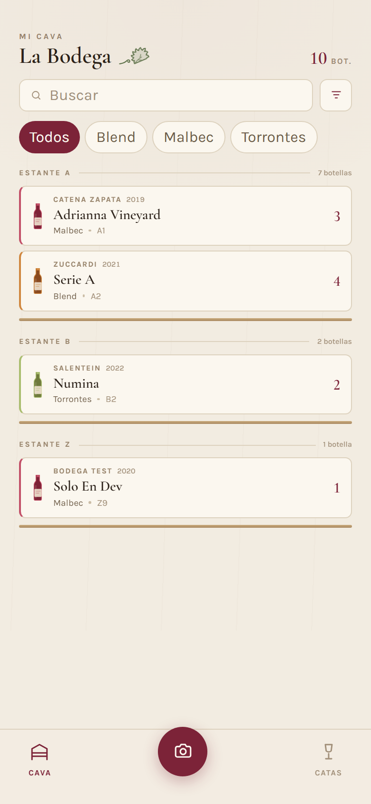
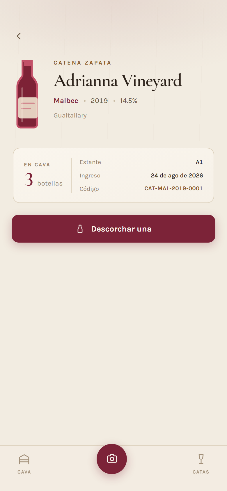

# Mi Cava Virtual

Inventario personal de vinos que se carga sacándole una foto a la etiqueta.
Gemini lee la etiqueta, los datos se corrigen en un formulario y todo queda
guardado en una planilla de Google Sheets.

Corre entero dentro del **free tier permanente** de Google Cloud: Cloud Run
escala a cero, la planilla hace de base de datos y las fotos entran en los 5 GB
gratis de Cloud Storage.

<table>
<tr>
<td width="50%"></td>
<td width="50%"></td>
</tr>
<tr>
<td><b>Mi cava</b> — botellas por estante, con búsqueda y filtro por varietal. Las agotadas caen al final, atenuadas.</td>
<td><b>Ficha</b> — stock, ubicación, código y el botón para descorchar, que registra la cata.</td>
</tr>
</table>

## Cómo funciona

```
Celular  ──foto──>  FastAPI  ──imagen──>  Gemini
                       │                    │
                       │  <──── JSON ───────┘
                       │
                       ├──filas──>  Google Sheets   (inventario y catas)
                       └──jpg────>  Cloud Storage   (fotos, bucket privado)
```

Una botella se carga en dos pasos: primero se crea el vino (JSON) y después se
le sube la foto. Así el escaneo que alguien abandona no deja fotos huérfanas.

## Stack

| Capa | Tecnología |
|---|---|
| Backend | Python 3.11, FastAPI, Pydantic |
| Frontend | React 19, TypeScript, Vite, Tailwind 4 |
| IA | Google Gemini (`gemini-3.6-flash`) |
| Datos | Google Sheets vía `gspread` |
| Fotos | Cloud Storage, bucket privado con URLs firmadas |
| Infra | Cloud Run, Secret Manager, Artifact Registry |

## API

| Método | Ruta | Qué hace |
|---|---|---|
| `GET` | `/health` | Chequeo de vida |
| `POST` | `/api/scan-label` | Sube una imagen y devuelve lo que Gemini pudo leer |
| `GET` | `/api/wines` | Lista el inventario |
| `GET` | `/api/wines/{codigo}` | Un vino, con su `foto_url` ya firmada |
| `POST` | `/api/wines` | Crea un vino y le asigna código |
| `POST` | `/api/wines/{codigo}/foto` | Sube la etiqueta al bucket |
| `POST` | `/api/wines/{codigo}/consume` | Descuenta una botella y registra la cata |

### Código de vino

Cada botella tiene un UUID técnico (`id`) y un código legible que es el que se
usa en la API:

```
TRA-MAL-2020-0001
 │   │    │    └── contador dentro de la combinación
 │   │    └─────── añada
 │   └──────────── 3 letras del varietal
 └──────────────── 3 letras de la bodega
```

## Entornos

Hay dos planillas y el entorno se elige por variable, sin tocar código:

| | Planilla | Fotos |
|---|---|---|
| **Local / DEV** | `Mi_Cava_Virtual_DEV` | sin bucket |
| **Producción** | `Mi_Cava_Virtual` | bucket privado en GCS |

En DEV `GCS_BUCKET_NAME` va vacío: el endpoint de foto responde 503 y todo lo
demás anda igual. Así probar en local no ensucia el bucket real ni el
inventario. Ambas planillas se comparten con la misma Service Account.

## Correrlo localmente

Hace falta `backend/.env` y `backend/credentials.json` (el JSON de una Service
Account de Google). Ninguno de los dos se versiona.

```env
GEMINI_API_KEY=tu_api_key
GOOGLE_SHEETS_CREDENTIALS_FILE=credentials.json
GOOGLE_SHEET_NAME=Mi_Cava_Virtual_DEV
MAX_IMAGE_SIZE_BYTES=10485760
GCS_BUCKET_NAME=            # vacío en DEV: la app anda igual, sin fotos
GCS_SIGNED_URL_TTL_SECONDS=3600
```

```bash
# backend
cd backend
../.venv/Scripts/python -m uvicorn app.main:app --port 8080

# frontend (proxea /api al backend, sin CORS)
cd frontend
npm install && npm run dev        # http://localhost:5173

# tests y lint
.venv/Scripts/python -m pytest backend/tests -q
.venv/Scripts/python -m ruff check backend/app backend/tests
```

Con Docker, montando las credenciales como lo hace Cloud Run:

```powershell
cd backend
docker build -t digital-wine-cellar:test .
$key = (Get-Content .env | Select-String "^GEMINI_API_KEY=").ToString() -replace '^GEMINI_API_KEY=',''
docker run -d --name dwc -p 8080:8080 `
  -v "${PWD}\credentials.json:/secrets/credentials.json:ro" `
  -e GOOGLE_SHEETS_CREDENTIALS_FILE=/secrets/credentials.json `
  -e GEMINI_API_KEY="$key" -e GOOGLE_SHEET_NAME=Mi_Cava_Virtual_DEV `
  digital-wine-cellar:test
```

## Desplegarlo

`infra/deploy.sh` hace todo el camino: crea el proyecto, vincula facturación,
habilita APIs, arma la Service Account y los secretos, crea el bucket, construye
la imagen con Cloud Build y despliega en Cloud Run.

```bash
PROJECT_ID=tu-proyecto bash infra/deploy.sh
```

Queda **un paso manual** sin el cual el backend no lee la planilla: compartir el
Sheet con el `client_email` del `credentials.json`, con permiso de Editor.

> Son dos identidades distintas y es fácil confundirlas. El Sheet lo lee la
> Service Account del JSON; Cloud Run *corre* con esa misma cuenta, pero
> compartir la planilla con cualquier otra no sirve.

La facturación hay que vincularla aunque todo entre en el free tier: sin una
cuenta asociada, Cloud Storage y Cloud Run devuelven 403 y no se habilitan.
Conviene poner un presupuesto de aviso:

```bash
gcloud billing budgets create \
  --billing-account=TU-BILLING-ID \
  --display-name="Cava - alerta 1 USD" \
  --budget-amount=1USD \
  --threshold-rule=percent=0.5 --threshold-rule=percent=1.0 \
  --filter-projects="projects/$(gcloud projects describe $PROJECT_ID --format='value(projectNumber)')"
```

El aviso llega por mail a los administradores de facturación. Notar que
**avisa, no corta**: si se dispara, el servicio sigue andando.

También hay una versión en Terraform en `infra/terraform` que provisiona lo
mismo de forma declarativa.

### Frontend

Se publica solo en **GitHub Pages** con `.github/workflows/deploy-frontend.yml`,
en cada push que toque `frontend/`. El hosting es gratis y no necesita
facturación.

Dos cosas hay que configurar una vez en el repo:

1. **Settings → Pages → Source: GitHub Actions**
2. **Settings → Secrets and variables → Actions → Variables**: crear
   `VITE_API_BASE` con la URL del backend en Cloud Run.

Sin esa variable el build falla a propósito, en vez de publicar un sitio que
no llama a ningún lado.

El workflow fija `base` en `/<repo>/` porque el sitio cuelga de un
subdirectorio, y copia `index.html` a `404.html` para que las rutas resuelvan
del lado del cliente.

Para buildear a mano:

```bash
cd frontend
VITE_API_BASE="https://tu-backend.run.app" BASE_PATH=/digital-wine-cellar/ npm run build
```

### Acceso

La app publicada está protegida con una clave compartida. No hay cuentas: la
app la pide al abrir, la guarda en el navegador y la manda en `X-App-Token`.

```bash
# generar una
python -c "import secrets; print(secrets.token_urlsafe(24))"

# guardarla y publicarla
gcloud secrets create app-token --replication-policy=automatic
printf '%s' "TU_TOKEN" | gcloud secrets versions add app-token --data-file=-
gcloud run deploy digital-wine-cellar-backend \
  --image=... --region=us-central1 \
  --update-secrets="APP_TOKEN=app-token:latest"
```

Sin `APP_TOKEN` la API queda abierta, que es lo cómodo en local. `/health`
siempre queda accesible, porque lo consulta la plataforma.

El chequeo es un middleware, no una dependencia de router: como dependencia,
FastAPI validaba el cuerpo primero y un POST mal formado sin clave devolvía 422
en vez de 401, revelando la forma del esquema. Va por dentro de CORS para que
hasta un 401 lleve sus cabeceras; si no, el navegador esconde la respuesta.

### CORS

El frontend publicado vive en otro dominio que el backend, así que Cloud Run
tiene que permitirlo explícitamente. La lista sale de `CORS_ALLOW_ORIGINS`
(separada por comas):

```bash
gcloud run deploy digital-wine-cellar-backend \
  --image=... --region=us-central1 \
  --update-env-vars="^|^CORS_ALLOW_ORIGINS=https://tu-usuario.github.io,http://localhost:5173"
```

El prefijo `^|^` cambia el separador de gcloud a `|`, porque si no la coma
dentro del valor se interpreta como fin de la variable.

En desarrollo no hace falta: el proxy de Vite hace que el navegador vea un solo
origen.

## Decisiones que vale la pena conocer

**Las fotos nunca se sirven públicamente.** El bucket tiene
`public-access-prevention` activo. En la columna `foto_url` del Sheet se guarda
el nombre del objeto, no una URL, y las URLs de lectura se firman on demand y
caducan a la hora. `foto_url` tampoco se acepta en `POST /api/wines`: solo lo
escribe el endpoint de foto, para que un cliente no pueda apuntarlo a una URL
arbitraria.

**Las credenciales no viajan en la imagen.** `.dockerignore` deja afuera `.env`
y `credentials.json`; en Cloud Run se inyectan desde Secret Manager, el JSON
montado como archivo y la API key como variable de entorno.

**Las fechas las pone el servidor.** `fecha_ingreso` y `fecha_consumo` se
generan server-side, nunca se aceptan del cliente.

**Las imágenes se validan de verdad.** No alcanza con el `content_type`
declarado: se abre con Pillow para confirmar que sea una imagen, además del
límite de tamaño.

**La planilla se edita a mano, así que nada confía en ella.** Una fila con datos
inválidos se descarta sin tumbar el listado entero, y en la UI una fecha que no
parsea o una añada menor a 1900 se omiten en vez de mostrarse crudas.

**Los números vienen con el formato puesto.** Una celda con formato de moneda no
llega como `32000` sino como `"$32.000"`, y eso hacía desaparecer el vino entero
del listado. `parse_sheet_number` los normaliza, distinguiendo el punto de miles
del decimal: en `"32.000"` el punto agrupa, en `"32.5"` separa decimales.

## La planilla

`backend/scripts/format_sheet.py` le da formato: encabezado fijo en color vino,
filtros, franjas alternadas, desplegables de varietal y puntuación, formato de
moneda en el precio, y reglas que apagan las filas sin stock y resaltan la
última botella. Es idempotente, se puede correr las veces que haga falta.

```bash
cd backend
../.venv/Scripts/python scripts/format_sheet.py                  # la de DEV
../.venv/Scripts/python scripts/format_sheet.py Mi_Cava_Virtual  # la de producción
```

| Pestaña | Contenido |
|---|---|
| `Inventario` | Una fila por vino: bodega, nombre, varietal, añada, región, alcohol, stock, ubicación, precio y código |
| `Historico_Catas` | Una fila por botella consumida: puntuación 1–5, notas y maridaje |

## Estructura

```
backend/
  app/
    routes/      health, scan, wines
    services/    gemini, sheets, storage, wine
    schemas/     validaciones Pydantic
    utils/       código de vino, validación de imágenes
  scripts/       formato de la planilla, utilidades
  tests/
frontend/
  src/
    screens/     CellarScreen, ScanScreen, WineScreen
    lib/         api, types, helpers de dominio
    components/  íconos SVG
infra/
  deploy.sh      deploy completo
  terraform/     la misma infra, declarativa
design/          artboards del diseño
```
