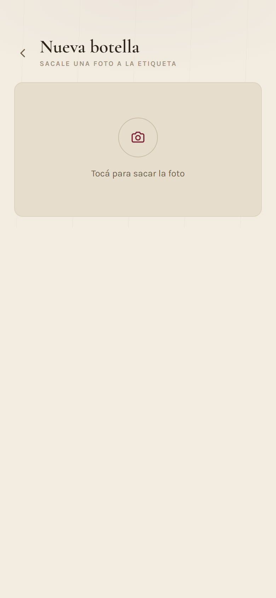

# Mi Cava Virtual

Inventario personal de vinos que se carga sacándole una foto a la etiqueta.
Gemini lee la etiqueta, los datos se corrigen en un formulario y todo queda
guardado en una planilla de Google Sheets.

Corre entero dentro del **free tier permanente** de Google Cloud: Cloud Run
escala a cero, la planilla hace de base de datos y las fotos entran en los 5 GB
gratis de Cloud Storage.

<table>
<tr>
<td width="33%"></td>
<td width="33%"></td>
<td width="33%"></td>
</tr>
<tr>
<td><b>Mi cava</b> — botellas por estante, con búsqueda y filtro por varietal.</td>
<td><b>Escanear</b> — la foto de la etiqueta completa el formulario sola.</td>
<td><b>Ficha</b> — stock, ubicación y el botón para descorchar.</td>
</tr>
</table>

## Qué hace

- **Cargar una botella** sacándole una foto a la etiqueta: Gemini completa
  bodega, varietal, añada, región y graduación, y lo que salga mal se corrige
  antes de guardar.
- **Ver la cava** agrupada por estante, con búsqueda y filtro por varietal. Un
  corte aparece bajo cada una de sus uvas, y las botellas agotadas caen al final.
- **Descorchar una botella**: descuenta el stock y registra la cata con
  puntuación, notas y maridaje.
- **Leer el histórico** de catas, agrupado por mes.
- **Editar, borrar o ajustar el stock** de un vino sin abrir la planilla. Borrar
  un vino conserva sus catas: son la única memoria de que esas botellas se
  tomaron.

Todo desde el celular, detrás de una clave compartida.

## Cómo funciona

```
Celular  ──foto──>  FastAPI  ──imagen──>  Gemini
                       │                    │
                       │  <──── JSON ───────┘
                       │
                       ├──filas──>  Google Sheets   (inventario y catas)
                       └──jpg────>  Cloud Storage   (fotos, bucket privado)
```

| Capa | Tecnología |
|---|---|
| Backend | Python 3.11, FastAPI, Pydantic |
| Frontend | React 19, TypeScript, Vite, Tailwind 4 |
| IA | Google Gemini (`gemini-3.6-flash`) |
| Datos | Google Sheets vía `gspread` |
| Fotos | Cloud Storage, bucket privado con URLs firmadas |
| Infra | Cloud Run, Secret Manager, Artifact Registry |

## Correrlo localmente

Hace falta `backend/.env` y `backend/credentials.json` (el JSON de una Service
Account de Google). Ninguno de los dos se versiona.

```bash
# backend  ->  http://localhost:8000
cd backend && uvicorn app.main:app --reload

# frontend ->  http://localhost:5173  (proxea /api al backend, sin CORS)
cd frontend && npm install && npm run dev

# tests y lint
pytest backend/tests -q && ruff check backend
```

En local se apunta a la planilla `Mi_Cava_Virtual_DEV` y sin bucket, así que
probar no toca producción.

## Más documentación

| | |
|---|---|
| [Puesta en marcha](docs/despliegue.md) | Desplegar en Cloud Run y GitHub Pages, entornos, acceso y CORS |
| [Cómo está hecho](docs/decisiones.md) | Las decisiones de diseño que no se deducen del código |
| [La planilla](docs/planilla.md) | Las dos pestañas y el script que les da formato |

## Estructura

```
backend/
  app/
    routes/      health, scan, wines
    services/    gemini, sheets, storage, wine
    schemas/     validaciones Pydantic
    utils/       código de vino, validación de imágenes
  scripts/       formato de la planilla, utilidades
  tests/
frontend/
  src/
    screens/     CellarScreen, CatasScreen, ScanScreen, WineScreen
    components/  íconos SVG, campos, hojas, fila de cata
    lib/         api, types, helpers de dominio
infra/
  terraform/     toda la infra, declarativa
design/          artboards del diseño
```
